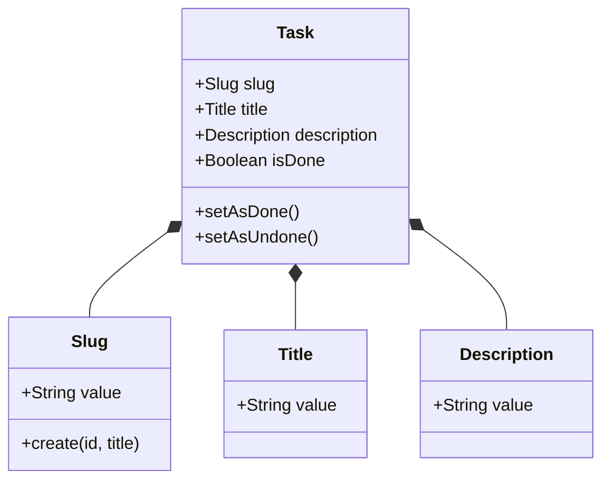
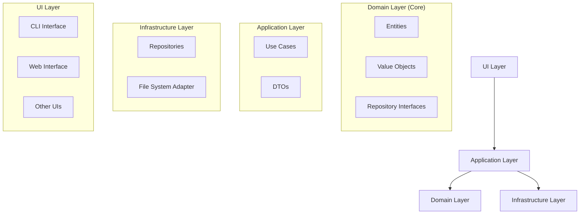

# Domain-Driven Design Architecture Plan for MarkTaskDown

This document outlines the architecture plan for separating the CLI implementation from the domain logic in the MarkTaskDown project using Domain-Driven Design principles.

## 1. Domain Analysis

### Core Domain

The core domain is task management, with Task as the central entity (aggregate root).

### Ubiquitous Language

- **Task**: A unit of work with a title, description, and completion flag
- **Slug**: The primary identifier for a task, derived from the title and a unique ID
- **Task Done Flag**: Whether a task is done or undone
- **Task Collection**: A group of tasks managed by the system

### Domain Model



## 2. Strategic Design

### Bounded Contexts

For this simple application, we have one primary bounded context:

- **Task Management Context**: Handles the creation, retrieval, updating, and deletion of tasks

## 3. Tactical Design

### Architecture Overview



## 4. Detailed Architecture Plan

### Domain Layer

The domain layer contains the core business logic and is independent of any external concerns.

#### Entities

- **Task**: The central entity representing a task with its properties and behaviors

#### Value Objects

- **Slug**: Represents the unique identifier for a task (format: `<ID>-<title>.md`)
- **Title**: Represents the task title
- **Description**: Represents the task description

#### Repository Interfaces

- **TaskRepository**: Defines the contract for persisting and retrieving tasks

### Application Layer

The application layer orchestrates the use cases by coordinating domain objects.

#### Use Cases (Commands)

- **CreateTaskUseCase**: Creates a new task
- **SetTaskAsDoneUseCase**: Sets a task as done
- **SetTaskAsUndoneUseCase**: Sets a task as undone
- **DeleteTaskUseCase**: Deletes a task

#### Use Cases (Queries)

- **GetAllTasksUseCase**: Retrieves all tasks
- **GetTaskBySlugUseCase**: Retrieves a task by its slug

#### DTOs (Data Transfer Objects)

- **TaskDTO**: Represents task data for transfer between layers
- **CreateTaskDTO**: Contains data needed to create a task
- **TaskListDTO**: Contains data for displaying a list of tasks

### Infrastructure Layer

The infrastructure layer provides implementations for interfaces defined in the domain layer.

#### Repositories

- **FileSystemTaskRepository**: Implements TaskRepository using the file system

#### Adapters

- **MarkdownFileAdapter**: Handles reading/writing markdown files with YAML frontmatter

### UI Layer

The UI layer handles user interaction through different interfaces.

#### CLI Interface

- **CLI Commands**: Implementations of CLI commands using Commander.js
- **CLI Presenters**: Format data for CLI output

#### Future Interfaces

- **Web Interface**: A potential future web UI
- **Desktop Interface**: A potential future desktop UI

## 5. Implementation Strategy with TDD

The implementation strategy follows a test-driven development approach, with detailed tasks for each phase of the implementation. All implementation tasks are documented in the `tasks/` directory, with each task file containing specific requirements, acceptance criteria, and implementation details.

### Implementation Phases

The implementation is divided into four main phases:

1. **Domain Layer Implementation**: Tasks for implementing the core domain entities, value objects, and repository interfaces.

2. **Application Layer Implementation**: Tasks for implementing the use cases (commands and queries) and DTOs.

3. **Infrastructure Layer Implementation**: Tasks for implementing the repository implementations and adapters.

4. **UI Layer Refactoring**: Tasks for refactoring the CLI commands to use the application use cases.

Each phase has corresponding task files in the `tasks/` directory, with naming conventions that indicate the phase and specific component being implemented (e.g., `task-11-implement-task-entity.md`, `task-31-implement-createtaskusecase.md`).

Refer to the task files for detailed implementation instructions and requirements for each component of the architecture.

## 6. Folder Structure

```
src/
├── domain/
│   ├── entities/
│   │   ├── Task.ts
│   │   └── Task.test.ts
│   ├── valueObjects/
│   │   ├── Slug.ts
│   │   ├── Slug.test.ts
│   │   ├── Title.ts
│   │   ├── Title.test.ts
│   │   ├── Description.ts
│   │   └── Description.test.ts
│   └── repositories/
│       ├── TaskRepository.ts
│       └── TaskRepository.test.ts
├── application/
│   ├── useCases/
│   │   ├── commands/
│   │   │   ├── CreateTaskUseCase.ts
│   │   │   ├── CreateTaskUseCase.test.ts
│   │   │   ├── SetTaskAsDoneUseCase.ts
│   │   │   ├── SetTaskAsDoneUseCase.test.ts
│   │   │   ├── SetTaskAsUndoneUseCase.ts
│   │   │   ├── SetTaskAsUndoneUseCase.test.ts
│   │   │   ├── DeleteTaskUseCase.ts
│   │   │   └── DeleteTaskUseCase.test.ts
│   │   └── queries/
│   │       ├── GetAllTasksUseCase.ts
│   │       ├── GetAllTasksUseCase.test.ts
│   │       ├── GetTaskBySlugUseCase.ts
│   │       └── GetTaskBySlugUseCase.test.ts
│   └── dtos/
│       ├── TaskDTO.ts
│       ├── CreateTaskDTO.ts
│       └── TaskListDTO.ts
├── infrastructure/
│   ├── repositories/
│   │   ├── FileSystemTaskRepository.ts
│   │   └── FileSystemTaskRepository.test.ts
│   └── adapters/
│       ├── MarkdownFileAdapter.ts
│       └── MarkdownFileAdapter.test.ts
├── ui/
│   ├── cli/
│   │   ├── commands/
│   │   │   ├── add.ts
│   │   │   ├── add.test.ts
│   │   │   ├── delete.ts
│   │   │   ├── delete.test.ts
│   │   │   ├── done.ts
│   │   │   ├── done.test.ts
│   │   │   ├── init.ts
│   │   │   ├── init.test.ts
│   │   │   ├── list.ts
│   │   │   └── list.test.ts
│   │   ├── presenters/
│   │   │   ├── TaskPresenter.ts
│   │   │   └── TaskPresenter.test.ts
│   │   └── cli.ts
│   └── components/
│       ├── Table.tsx
│       └── Table.test.tsx
└── index.ts
```

## 7. Benefits of This Architecture

### Alignment with DDD Principles

1. **Focus on the Core Domain**: The domain layer contains the essential business logic
2. **Rich Domain Model**: Entities with behavior, not just data structures
3. **Ubiquitous Language**: Consistent terminology throughout the codebase
4. **Separation of Concerns**: Clear boundaries between layers

### Technical Benefits

1. **Testability**: Domain and application logic can be tested in isolation
2. **Flexibility**: Easy to add new interfaces (web, GUI, etc.)
3. **Maintainability**: Changes to one layer don't affect others
4. **Reusability**: Domain logic can be reused across different interfaces

## 8. Potential Challenges and Considerations

1. **Complexity vs. Simplicity**: DDD introduces some complexity that might seem excessive for a simple application. However, it provides a solid foundation for future growth.

2. **Learning Curve**: Team members might need time to adapt to DDD concepts.

3. **Performance**: The additional layers might introduce some overhead, but the impact should be minimal for this type of application.

4. **Backward Compatibility**: Ensure that the new architecture can work with existing task files.

## 9. Transition Strategy

To transition from the current architecture to the new one, we will use an incremental approach that maintains backward compatibility throughout the process. This strategy minimizes risk and allows for continuous delivery of working software.

### Incremental Implementation Approach

1. **Start with the Domain Layer**

   1. Implement the Task entity and value objects
   2. Define the TaskRepository interface
   3. Write comprehensive tests for these components

2. **Implement the Infrastructure Layer**

   1. Create the FileSystemTaskRepository implementation
   2. Ensure it can work with existing task files
   3. Verify with tests that it correctly reads and writes task files

3. **Implement Application Layer Use Cases**

   1. Implement one use case at a time, starting with the most fundamental ones
   2. Begin with CreateTaskUseCase and GetAllTasksUseCase as they form the core functionality
   3. Follow with SetTaskAsDoneUseCase, SetTaskAsUndoneUseCase, and DeleteTaskUseCase
   4. Complete with GetTaskBySlugUseCase

4. **Refactor CLI Commands One by One**
   1. Start with the simplest command (init) to establish the pattern
   2. Refactor each command to use the corresponding use case
   3. Maintain the same CLI interface to ensure backward compatibility
   4. Verify each refactored command with tests before moving to the next

### Maintaining Backward Compatibility

Throughout this process, we will ensure backward compatibility by:

1. **Preserving File Format**: The new implementation will use the same markdown file format with YAML frontmatter
2. **Keeping CLI Interface**: The command-line interface will remain unchanged
3. **Ensuring Data Integrity**: Existing task files will continue to work with the new implementation
4. **Comprehensive Testing**: Each step will be thoroughly tested to verify compatibility

### Transition Plan

The transition will be implemented in phases, with each phase building on the previous one:

1. **Phase 1**: Domain Layer
2. **Phase 2**: Infrastructure Layer
3. **Phase 3**: Application Layer Use Cases
4. **Phase 4**: CLI Command Refactoring

This plan allows for thorough testing and validation at each step, ensuring a smooth transition to the new architecture.
