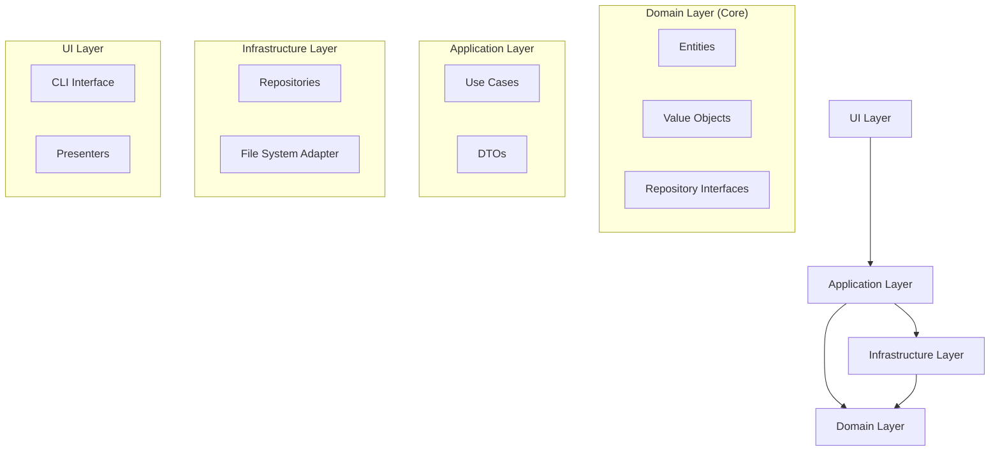

# MarkTaskDown Developer Documentation

This document provides detailed information about the MarkTaskDown project architecture, development workflow, and testing approach for developers who want to contribute to or understand the project.

## Table of Contents

- [Project Architecture](#project-architecture)
  - [Domain Layer](#domain-layer)
  - [Application Layer](#application-layer)
  - [Infrastructure Layer](#infrastructure-layer)
  - [UI Layer](#ui-layer)
- [Data Flow](#data-flow)
- [Testing Strategy](#testing-strategy)
  - [Unit Tests](#unit-tests)
  - [Integration Tests](#integration-tests)
  - [System Tests](#system-tests)
- [Development Workflow](#development-workflow)
- [Project Structure](#project-structure)

## Project Architecture

MarkTaskDown follows [Domain-Driven Design (DDD)](https://en.wikipedia.org/wiki/Domain-driven_design) principles with a [clean architecture](https://blog.cleancoder.com/uncle-bob/2012/08/13/the-clean-architecture.html) approach. The codebase is organized into four distinct layers:



### Domain Layer

The domain layer is the core of the application and contains the business logic. It is independent of any external concerns and defines the entities, value objects, and repository interfaces.

#### Entities

Entities are objects with an identity that persists over time:

- **Task**: The central entity representing a task with properties like title, description, and completion status.

#### Value Objects

Value objects are immutable objects that have no identity:

- **Slug**: Represents the unique identifier for a task
- **Title**: Represents the task title
- **Description**: Represents the task description

#### Repository Interfaces

Repository interfaces define the contract for data access:

- **TaskRepository**: Defines methods for persisting and retrieving tasks
- **ProjectRepository**: Defines methods for project-related operations

### Application Layer

The application layer orchestrates the [use cases](https://en.wikipedia.org/wiki/Use_case) by coordinating domain objects. It contains use cases (commands and queries) and DTOs.

#### Use Cases (Commands)

Command use cases modify the state of the system:

- **CreateTaskUseCase**: Creates a new task
- **SetTaskAsDoneUseCase**: Sets a task as done
- **SetTaskAsUndoneUseCase**: Sets a task as undone
- **DeleteTaskUseCase**: Deletes a task
- **InitializeProjectUseCase**: Initializes a new project

#### Use Cases (Queries)

Query use cases retrieve data from the system:

- **GetAllTasksUseCase**: Retrieves all tasks
- **GetTaskBySlugUseCase**: Retrieves a task by its slug

#### DTOs (Data Transfer Objects)

DTOs are used for transferring data between layers:

- **CreateTaskDTO**: Contains data needed to create a task
- **InitializeProjectResultDTO**: Contains the result of initializing a project

### Infrastructure Layer

The infrastructure layer provides implementations for interfaces defined in the domain layer. It contains repositories and adapters.

#### Repositories

Repository implementations handle data persistence:

- **FileSystemTaskRepository**: Implements TaskRepository using the file system
- **FileSystemProjectRepository**: Implements ProjectRepository using the file system

#### Adapters

Adapters handle external services or libraries:

- **MarkdownFileAdapter**: Handles reading/writing markdown files with YAML frontmatter

### UI Layer

The UI layer handles user interaction through different interfaces. Currently, it only contains the CLI interface.

#### CLI Interface

The CLI interface is implemented using [Commander.js](https://github.com/tj/commander.js/):

- **Commands**: Implementations of CLI commands (add, list, done, delete, init)

#### Presenters

Presenters format domain entities for presentation:

- **TaskPresenter**: Formats Task entities for display

## Data Flow

The data flow in the application follows these patterns:

1. **Command Flow** (modifying data):

   ```mermaid
   graph LR
       A[UI Layer: Command] --> B[Application Layer: Use Case]
       B --> C[Domain Layer: Entities]
       C --> D[Infrastructure Layer: Repository]
   ```

2. **Query Flow** (retrieving data):
   ```mermaid
   graph LR
       A[UI Layer: Command] --> B[Application Layer: Use Case]
       B --> D[Infrastructure Layer: Repository]
       D --> C[Domain Layer: Entities]
       C --> E[UI Layer: Presenter]
   ```

## Testing Strategy

MarkTaskDown follows a comprehensive testing strategy with different types of tests:

### Unit Tests

Unit tests verify the behavior of individual components in isolation:

- **Domain Layer Tests**: Test entities, value objects, and repository interfaces
- **Application Layer Tests**: Test use cases with mocked dependencies
- **Infrastructure Layer Tests**: Test repositories and adapters
- **UI Layer Tests**: Test presenters and command handlers

### Integration Tests

Integration tests verify that different components work together correctly:

- **CLI Integration Tests**: Test the CLI commands with mocked dependencies
- **Repository Integration Tests**: Test repositories with actual file system

### System Tests

System tests verify the entire system working together:

- **End-to-End Tests**: Test the entire workflow from initialization to task deletion

## Development Workflow

MarkTaskDown follows the [Test-Driven Development (TDD)](https://en.wikipedia.org/wiki/Test-driven_development) approach:

1. 🔴 **RED**: Write failing tests first that define the expected behavior
2. 🟢 **GREEN**: Implement the minimal code needed to make tests pass
3. ♻️ **REFACTOR**: Clean up the code while keeping tests passing

For new features or changes:

1. Create a new task using the `mtd add` command
2. Write tests for the new feature
3. Implement the feature
4. Run tests to ensure they pass
5. Mark the task as done using the `mtd done` command
6. Commit changes with the appropriate gitmoji prefix

## Project Structure

```
marktaskdown/
├── docs/                  # Documentation
├── src/                   # Source code
│   ├── domain/            # Domain layer
│   │   ├── entities/      # Domain entities
│   │   ├── valueObjects/  # Value objects
│   │   └── repositories/  # Repository interfaces
│   ├── application/       # Application layer
│   │   ├── useCases/      # Use cases (commands and queries)
│   │   └── dtos/          # Data Transfer Objects
│   ├── infrastructure/    # Infrastructure layer
│   │   ├── repositories/  # Repository implementations
│   │   └── adapters/      # External service adapters
│   ├── ui/                # UI layer
│   │   ├── cli/           # CLI interface
│   │   └── presenters/    # Presenters for formatting output
│   └── tests/             # Integration and system tests
├── tasks/                 # Task files
└── package.json           # Project configuration
```

This structure follows the principles of Domain-Driven Design and Clean Architecture, with clear separation of concerns between layers.
