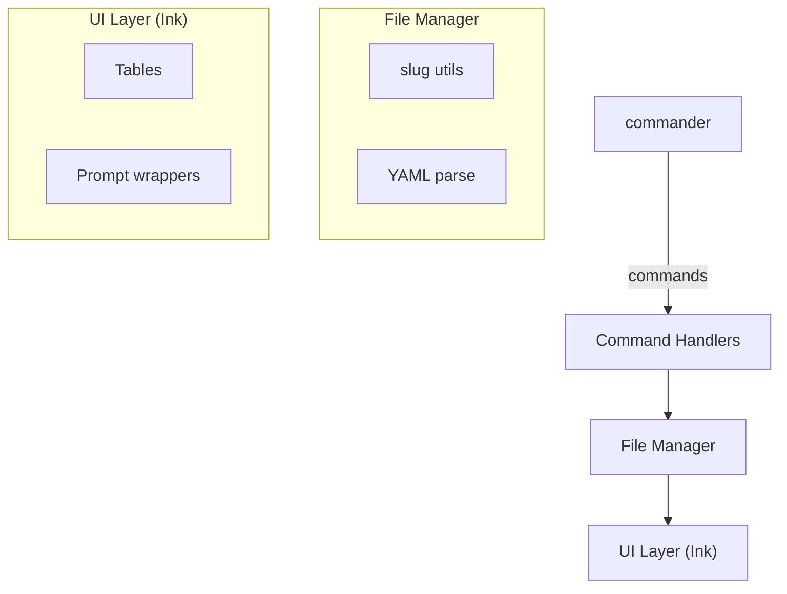

# MarkTaskDown `mtd` - Prototype Product Requirement Document

A lightweight CLI for managing tasks as Markdown files with YAML front-matter.

- text-native
- offline-first
- git-friendly.

---

## 0. Locked-In Decisions

- Runtime: Node 22 LTS
- Language / Tooling: TypeScript, tsup (build), vitest (tests), eslint + prettier.
- Arg parsing: **commander**.
- Prompts / forms: **enquirer**.
- Table & UI rendering: **ink** + **ink-table**.
- No dates, tags, or config file in MVP.
- File naming: `<slug>.md` stored in `/tasks`.

---

## 1. Feature List (MVP)

1. `mtd init`

   - Creates `/tasks` folder (or uses existing).
   - Adds `.gitkeep` so folder commits cleanly.

2. `mtd add` (interactive)

   - enquirer prompt:
     - Title (required)
     - Description (optional; opens `$EDITOR` if chosen)
   - Generates slug (`kebab-case` of title; if clash, append `-1`, `-2`, …).
   - Creates `tasks/<slug>.md` with:

   ```
   ---
   title: <title>
   is_done: false
   ---

   <description>
   ```

3. `mtd list`

   - Reads every `*.md` in `/tasks`.
   - Renders Ink table showing: slug | title | is_done.
   - Colour: green for done, red for pending.

4. `mtd done` (interactive)

   - Lists all tasks where `is_done == false` in an enquirer multi-select.
   - On confirm, toggles `is_done: true` in chosen files.
   - Success message per task.

5. `mtd delete` (interactive)

   - Multi-select list of all tasks (regardless of status).
   - Confirmation prompt.
   - Moves chosen files to `/tasks/.archive/`.

Nice-to-have polish (fits in 2-week window if time permits)

- `mtd undone` (toggle back) via same mechanism.
- Zero-dep single binary via `pkg` for easier install.

---

## 2. Architecture Overview

Component diagram



---

## 3. Development Roadmap & Story Points

| Sprint | Story                                                        | Pts |
| ------ | ------------------------------------------------------------ | --- |
| 0      | Repo scaffolding, tsconfig, eslint, prettier, GitHub Actions | 2   |
| 1      | `init` + folder utils                                        | 3   |
| 1      | Slug generator + YAML writer                                 | 3   |
| 2      | `add` interactive form                                       | 4   |
| 2      | Markdown file creation tests                                 | 3   |
| 3      | `list` with Ink & ink-table                                  | 5   |
| 4      | `done` interactive multi-select                              | 4   |
| 4      | `delete` with archive folder                                 | 3   |
| 5      | CLI help docs, README quick-start, packaging via tsup        | 3   |
| 6      | Buffer / bug-fix, codecov badge                              | 2   |

(1 pt ≈ half-day for one dev; MVP fits ~2 weeks.)

Milestone 1 (1-2 months)

- Config file `.mtd.yml` (task dir, archive dir).
- Filters for `list`.
- Tags, due dates (optional fields).
- Release pipeline producing single cross-platform binaries.

Stretch

- VS Code sidebar via WebView.
- GitHub Issues sync.
- AI agent embedding API.

---

## 4. Misc. Engineering Guidelines

- Code style: @typescript-eslint/recommended + prettier (auto-fix on commit via husky).
- Tests: vitest + ts-node for E2E; >80 % coverage gate.
- Branch naming: `feat/<slug>`, `fix/<slug>`, `chore/<slug>`.
- [Gitmoji](https://gitmoji.dev/) commit format for versioning (e.g., `🎉 Initial project setup`).
- CI (GitHub Actions): install → lint → test → build.
- Avoid over-abstraction; one file per command until complexity warrants split.
- Keep external deps minimal; revisit after MVP.
- Use Domain-Driven Design (DDD) approach for code organization.

---

## 5. Open Questions (flag for later but not MVP-blocking)

1. Should `add` open `$EDITOR` for multi-line description or keep inline?
2. Strategy for slug collisions in large repos (hash vs. numeric suffix).
3. How to display archived tasks (`mtd list --archived` future flag).
4. ~~License: MIT vs. Apache-2~~ → MIT license chosen.

---

🚀 You’re set to start coding the prototype.
The doc is a living spec—iterate freely as insights emerge!
