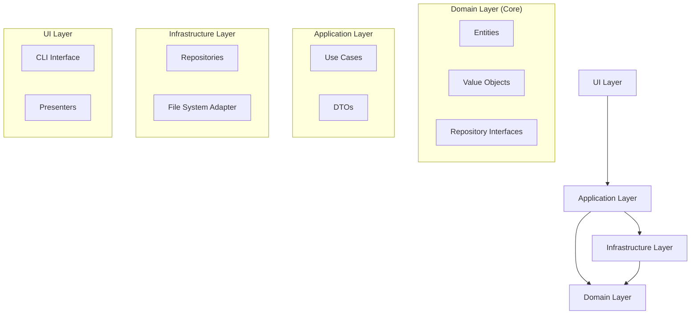

# MarkTaskDown `mtd` - Prototype Product Requirement Document

A lightweight CLI for managing tasks as Markdown files with YAML front-matter.

- text-native
- offline-first
- git-friendly.

---

## 0. Locked-In Decisions

- Runtime: Node 22 LTS
- Language / Tooling: TypeScript, tsup (build), vitest (tests), eslint + prettier.
- Arg parsing: **commander**.
- Prompts / forms: **[@inquirer/prompts](https://www.npmjs.com/package/@inquirer/prompts)**.
- Table & UI rendering: **[ink](https://github.com/vadimdemedes/ink)**.
- No dates, tags, or config file in MVP.
- File naming: `<slug>.md` stored in `/tasks`.

---

## 1. Feature List (MVP)

1. `mtd init`

   - Creates `/tasks` folder (or uses existing).
   - Adds `.gitkeep` so folder commits cleanly.

2. `mtd add` (interactive)

   - @inquirer/prompts:
     - Title (required)
     - Description (optional; opens `$EDITOR` if chosen)
   - Generates slug (`kebab-case` of title).
   - Creates `tasks/<slug>.md` with:

   ```
   ---
   title: <title>
   is_done: false
   ---

   <description>
   ```

3. `mtd list`

   - Reads every `*.md` in `/tasks`.
   - Renders Ink table showing: slug | title | is_done.
   - Colour: green for done, red for pending.

4. `mtd done` [slugs...] (interactive or direct)

   - When called without arguments: Lists all tasks where `is_done == false` in a checkbox prompt.
   - When called with task slugs as arguments: Marks those specific tasks as done.
   - Example: `mtd done task-1 task-2` marks tasks with slugs "task-1" and "task-2" as done.
   - On confirm, toggles `is_done: true` in chosen files.
   - Success message per task.

5. `mtd delete` (interactive)

   - Multi-select list of all tasks (regardless of status).
   - Confirmation prompt.
   - Moves chosen files to `/tasks/.archive/`.

Nice-to-have polish (fits in 2-week window if time permits)

- `mtd undone` (toggle back) via same mechanism.
- Zero-dep single binary via `pkg` for easier install.

---

## 2. Architecture Overview

MarkTaskDown follows Domain-Driven Design (DDD) principles with a clean architecture approach. The codebase is organized into the following layers:



For more detailed information about the architecture, see:

- [architecture-plan.md](../architecture-plan.md) - Detailed architecture plan
- [docs/DEVELOPER.md](./DEVELOPER.md) - Developer documentation

---

## 3. Development Roadmap & Story Points

| Sprint | Story                                                        | Pts |
| ------ | ------------------------------------------------------------ | --- |
| 0      | Repo scaffolding, tsconfig, eslint, prettier, GitHub Actions | 2   |
| 1      | `init` + folder utils                                        | 3   |
| 1      | Slug generator + YAML writer                                 | 3   |
| 2      | `add` interactive form                                       | 4   |
| 2      | Markdown file creation tests                                 | 3   |
| 3      | `list` with Ink                                              | 5   |
| 4      | `done` interactive multi-select                              | 4   |
| 4      | `delete` with archive folder                                 | 3   |
| 5      | CLI help docs, README quick-start, packaging via tsup        | 3   |
| 6      | Buffer / bug-fix, codecov badge                              | 2   |

(1 pt ≈ half-day for one dev; MVP fits ~2 weeks.)

Milestone 1 (1-2 months)

- Config file `.mtd.yml` (task dir, archive dir).
- Filters for `list`.
- Tags, due dates (optional fields).
- Release pipeline producing single cross-platform binaries.

Stretch

- VS Code sidebar via WebView.
- GitHub Issues sync.
- AI agent embedding API.
- Enhanced MCP server capabilities.

---

## 4. Misc. Engineering Guidelines

- Code style: @typescript-eslint/recommended + prettier (auto-fix on commit via husky).
- Tests: vitest + ts-node for E2E; >80 % coverage gate.
- Branch naming: `feat/<slug>`, `fix/<slug>`, `chore/<slug>`.
- [Gitmoji](https://gitmoji.dev/) commit format for versioning (e.g., `🎉 Initial project setup`).
- CI (GitHub Actions): install → lint → test → build.
- Avoid over-abstraction; one file per command until complexity warrants split.
- Keep external deps minimal; revisit after MVP.
- Use Domain-Driven Design (DDD) approach for code organization.
- Follow the Red-Green-Refactor TDD workflow:
  - 🔴 RED: Write failing tests first that define the expected behavior
  - 🟢 GREEN: Implement the minimal code needed to make tests pass
  - ♻️ REFACTOR: Clean up the code while keeping tests passing

---

## 5. Open Questions (flag for later but not MVP-blocking)

1. Should `add` open `$EDITOR` for multi-line description or keep inline?
2. Strategy for slug collisions in large repos (hash vs. numeric suffix).
3. How to display archived tasks (`mtd list --archived` future flag).
4. ~~License: MIT vs. Apache-2~~ → MIT license chosen.

---

## 6. MCP Server

MarkTaskDown includes a Model Context Protocol (MCP) server that allows LLM applications to interact with your tasks.

### What is MCP?

The Model Context Protocol (MCP) is a standard that enables Large Language Models (LLMs) to interact with external tools and resources. With MarkTaskDown's MCP server, LLMs can manage your tasks directly.

### Starting the MCP Server

There are two ways to start the MCP server:

1. Using the CLI command:

   ```bash
   mtd mcp-server
   ```

2. Using the standalone entry point (if built as a separate binary):
   ```bash
   mtd-mcp
   ```

Both methods start the server with STDIO transport, allowing LLM applications to interact with your tasks. The server will continue running until you press Ctrl+C.

### Available Tools

The MCP server provides the following tools:

#### initialize-project

Initializes a new MarkTaskDown project.

- **Parameters**: None
- **Example Response**:
  ```json
  {
    "content": [
      {
        "type": "text",
        "text": "Project initialized at ./tasks"
      }
    ]
  }
  ```
- **Error Handling**: Returns an error message if initialization fails

#### create-task

Creates a new task.

- **Parameters**:
  - `title` (required): The title of the task
  - `description` (optional): The description of the task
- **Example Response**:
  ```json
  {
    "content": [
      {
        "type": "text",
        "text": "Task created: Implement new feature (implement-new-feature)"
      }
    ]
  }
  ```
- **Error Handling**: Returns an error message if task creation fails

#### set-task-done

Marks a task as done.

- **Parameters**:
  - `slug` (required): The slug of the task to mark as done
- **Example Response**:
  ```json
  {
    "content": [
      {
        "type": "text",
        "text": "Task marked as done: Implement new feature (implement-new-feature)"
      }
    ]
  }
  ```
- **Error Handling**: Returns an error message if the task cannot be marked as done

#### set-task-undone

Marks a task as undone.

- **Parameters**:
  - `slug` (required): The slug of the task to mark as undone
- **Example Response**:
  ```json
  {
    "content": [
      {
        "type": "text",
        "text": "Task marked as undone: Implement new feature (implement-new-feature)"
      }
    ]
  }
  ```
- **Error Handling**: Returns an error message if the task cannot be marked as undone

#### delete-task

Deletes a task.

- **Parameters**:
  - `slug` (required): The slug of the task to delete
- **Example Response**:
  ```json
  {
    "content": [
      {
        "type": "text",
        "text": "Task deleted: Implement new feature (implement-new-feature)"
      }
    ]
  }
  ```
- **Error Handling**: Returns an error message if the task cannot be deleted

### Available Resources

The MCP server provides the following resources:

#### tasks://list

Returns a list of all tasks.

- **URI Pattern**: `tasks://list`
- **Example Response**:
  ```json
  {
    "contents": [
      {
        "uri": "tasks://list",
        "text": "- [ ] Implement new feature (implement-new-feature)\n- [x] Fix bug (fix-bug)"
      }
    ]
  }
  ```
- **Error Handling**: Returns an error message if tasks cannot be listed

#### tasks://{slug}

Returns details of a specific task.

- **URI Pattern**: `tasks://{slug}` (e.g., `tasks://implement-new-feature`)
- **Example Response**:
  ```json
  {
    "contents": [
      {
        "uri": "tasks://implement-new-feature",
        "text": "# Implement new feature\n\nStatus: Not Done\nSlug: implement-new-feature\n\nAdd the ability to mark tasks as done"
      }
    ]
  }
  ```
- **Error Handling**: Returns an error message if the task cannot be found

### Usage Examples

#### Example: Initializing a Project

```javascript
// Example of using the initialize-project tool
const response = await mcpClient.tool("initialize-project", {});
console.log(response.content[0].text); // "Project initialized at ./tasks"
```

#### Example: Creating and Managing Tasks

```javascript
// Create a new task
const createResponse = await mcpClient.tool("create-task", {
  title: "Implement new feature",
  description: "Add the ability to mark tasks as done",
});
console.log(createResponse.content[0].text); // "Task created: Implement new feature (implement-new-feature)"

// Mark the task as done
const doneResponse = await mcpClient.tool("set-task-done", {
  slug: "implement-new-feature",
});
console.log(doneResponse.content[0].text); // "Task marked as done: Implement new feature (implement-new-feature)"
```

#### Example: Retrieving Task Information

```javascript
// Get a list of all tasks
const listResponse = await mcpClient.resource("tasks://list");
console.log(listResponse.contents[0].text);
// "- [ ] Implement new feature (implement-new-feature)
// - [x] Fix bug (fix-bug)"

// Get details of a specific task
const taskResponse = await mcpClient.resource("tasks://implement-new-feature");
console.log(taskResponse.contents[0].text);
// "# Implement new feature
//
// Status: Not Done
// Slug: implement-new-feature
//
// Add the ability to mark tasks as done"
```

🚀 You're set to start coding the prototype.
The doc is a living spec—iterate freely as insights emerge!
